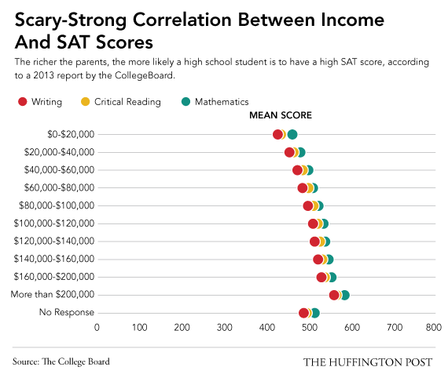

# Mapping NYC SAT Data

===============================

Project 
-------
*   [Blog](https://github.com/eringrand/2015-14-04-22-satblogpost.md)
*   [GitHub Repository](https://github.com/eringrand/edavproj)

Team
-------

*   Maura Fitzgerald
*   Erin Grand
*   Casey Huang
*   Xu (Conan) Huang
*   Stephen Ra

Motivation
------------

There has already been a plethora of [anecdotal](http://articles.latimes.com/2003/jul/27/local/me-sat27) and [empirical evidence](http://economix.blogs.nytimes.com/2009/08/27/sat-scores-and-family-income/?_r=1) suggesting a relationship between a student's SAT scores and their family's income. For example, this from the Huffington Post in 2013:

In general, a higher income bracket of a student's family predicts a higher SAT score. While this is
already well-trodden territory, we wanted to explore and visualize this relationship specifically in New York City and using
publicly available data from NYC Open Data, nyc.gov, and NYU's Furman Center for Real Estate and Urban Policy. Outside of simply income,
we also take a look at a number of other features.

Repository Hierarchy
--------------------
    .
    ├── css             Our custom css
    ├── js              Our custom js
    ├── json            Our JSON files
    ├── lib             Third-party libraries
    │   ├── bootstrap
    │   ├── d3
    │   ├── jquery
    ├── resource        Some HTML display messages
    ├── scripts         Our scripts
    │   └── school_info_join
    ├── about.html      About page
    ├── findings.html   Findings summary page
    ├── index.html      Main map page
    └── README.md       This file

Dependencies and Tools
----------------------

*   Bootstrap - For HTML and CSS templates
*   D3.js -  Javascript library that aids in the creation and control of
    interactive graphics on the web
*   Github - Collaboration and version control
*   Quantum GIS (QGIS) - An open source geographic information systems (GIS)
    application
*   R - For statistical analysis
*   Python- For some simple scripting

Links
-----------

*   [NYC Open Data](https://nycopendata.socrata.com/) for data sets
*   [NYC.gov](http://www1.nyc.gov/) for data sets and NYC shapefiles
*   [Mike Bostock](http://bl.ocks.org/mbostock) for D3 examples and some
    borrowed CSS templating
